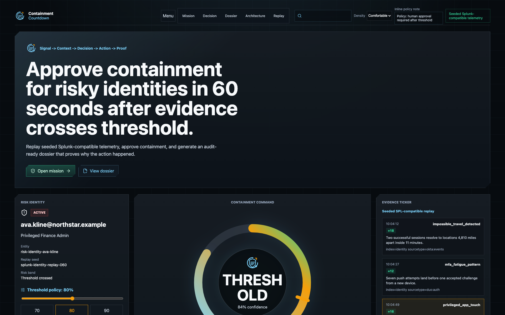
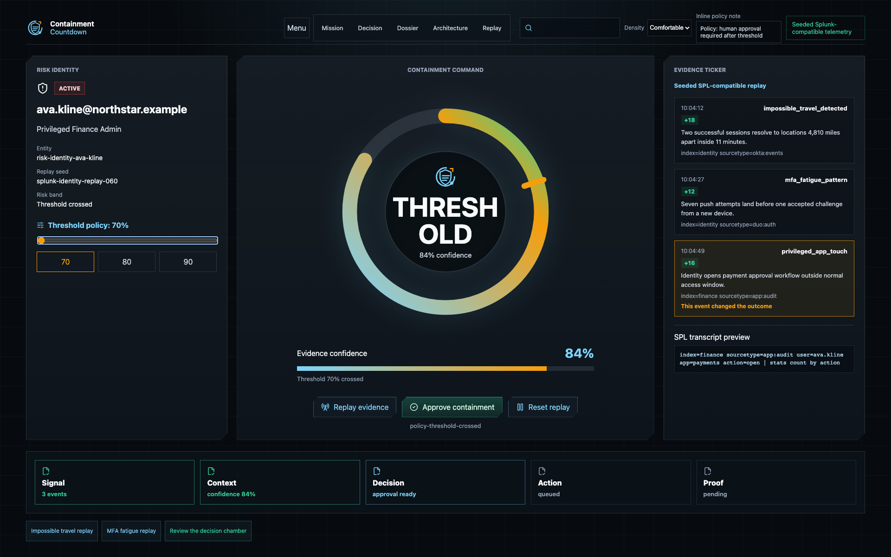
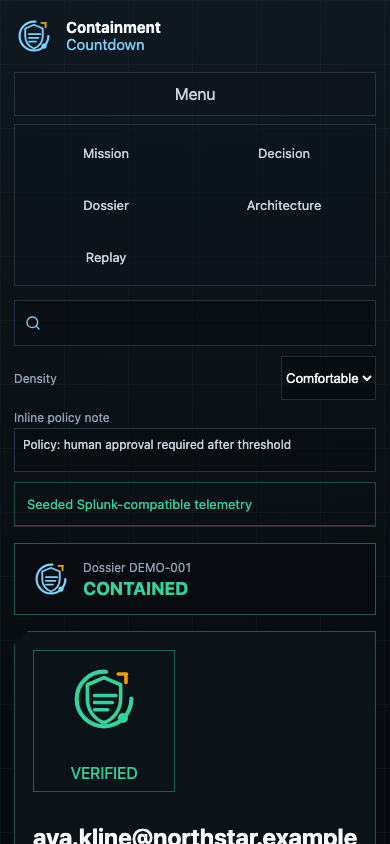
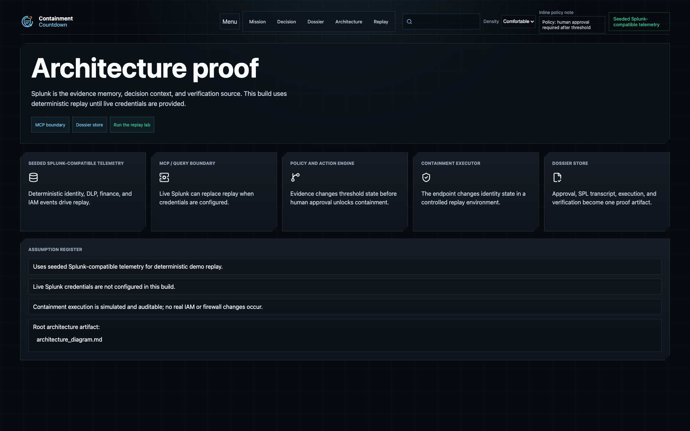
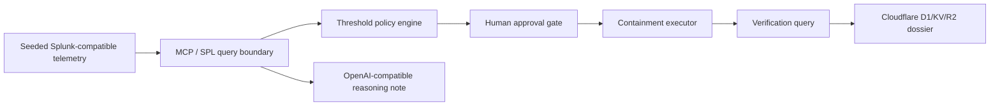

<div align="center">



# Containment Countdown

> **Approve containment for risky identities in 60 seconds after evidence crosses threshold.**

Evidence crosses threshold, a human approves containment, and a stored dossier proves the action.

[](https://containment-countdown.veithly.workers.dev)
[](./pitch/recording/pitch-demo-combined-final.mp4)
[](./docs/DEPLOYMENT.md)
[](./LICENSE)

**Quick links:**
[Live demo](https://containment-countdown.veithly.workers.dev) ·
[Architecture](./docs/ARCHITECTURE.md) ·
[Deployment](./docs/DEPLOYMENT.md) ·
[Root diagram](./architecture_diagram.md)

</div>

---

## Why This Matters

Identity incidents often stop at a summary. Containment Countdown makes the next step visible: evidence accumulates, confidence crosses a policy threshold, an operator approves, and the proof artifact survives the demo.

This deployment uses seeded Splunk-compatible telemetry because live Splunk credentials are not configured. The production Worker still does real work: approval writes land in Cloudflare D1, KV, and R2, and the reasoning note comes from a server-side OpenAI-compatible API call.

| | Static dashboard | Alert summary | **Containment Countdown** |
| --- | --- | --- | --- |
| Operator action | Inspect charts | Read text | **Approve or hold containment** |
| Proof | Screenshot | Paragraph | **Dossier with evidence, action, verification** |
| Runtime | View-only | Model-only | **Public Worker with D1/KV/R2 writes** |

## 30-Second Demo

<table>
  <tr>
    <td width="50%"></td>
    <td width="50%"></td>
  </tr>
  <tr>
    <td><b>1.</b> The judge sees the claim and opens the mission.</td>
    <td><b>2.</b> Evidence crosses threshold and the approval gate becomes active.</td>
  </tr>
  <tr>
    <td width="50%"></td>
    <td width="50%"></td>
  </tr>
  <tr>
    <td><b>3.</b> The dossier proves the identity is contained.</td>
    <td><b>4.</b> The architecture names the replay boundary and live services.</td>
  </tr>
</table>

## Quick Start

```bash
npm install
cp .env.local .env.local.example   # optional: inspect variable names without copying values
npm run dev
```

Open <http://localhost:4387>, then click **Open mission**.

Production smoke:

```bash
DEPLOYED_URL=https://containment-countdown.veithly.workers.dev npx playwright test
node /Users/rick/Documents/MySkill/hackathonhunter-skill/scripts/visual_qa_scan.mjs /Users/rick/Documents/Project/Hackathon/Splunk --url https://containment-countdown.veithly.workers.dev --fail-on warn
```

## How It Works



| Layer | Choice | Why |
| --- | --- | --- |
| App | Next.js App Router on Cloudflare Workers | Public URL with server-side route handlers |
| Evidence | Seeded Splunk-compatible telemetry | Honest replay until live Splunk credentials exist |
| Reasoning | OpenAI-compatible API | Server-side SOC note, no browser-exposed key |
| Storage | Cloudflare D1/KV/R2 | Durable proof chain for approvals and dossiers |
| Testing | Playwright + visual QA | Hero path and mobile proof path both checked |

## Bounty Fit

| Track | Fit |
| --- | --- |
| Security | Risky identity containment, approval control, and verification proof. |
| Platform & Developer Experience | Clear Cloudflare deployment, root architecture diagram, reproducible smoke commands. |
| Splunk AI story | Splunk-compatible evidence drives the visible workflow; live Splunk REST credentials can replace replay. |

## Boundary

- The current public demo does **not** claim live Splunk connectivity.
- `SPLUNK_HOST`, `SPLUNK_TOKEN`, and `SPLUNK_INDEX` are optional live-mode values.
- `OPENAI_API_KEY`, `OPENAI_BASE_URL`, and `OPENAI_DEFAULT_MODEL` are server-side Worker secrets.
- No real IAM or firewall change occurs in replay mode.

## Repository Layout

```text
.
├── src/app                 # Next.js routes and API handlers
├── src/components          # Mission cockpit, decision chamber, dossier view
├── src/lib                 # Containment model, Splunk boundary, AI, storage
├── migrations              # D1 schema
├── docs                    # Architecture, deployment, screenshots
├── pitch                   # Draft deck, recording, visual QA, GPT Pro evidence
└── .hunter                 # HackathonHunter gate state and reports
```

## Reproduce The Demo Package

```bash
npm run screenshots
npx tsx /Users/rick/Documents/MySkill/hackathonhunter-skill/scripts/narrate_tts.ts artifacts/narration.json
npm run record
npm run video:assemble
```

## License

MIT. Built for the Splunk Agentic Ops Hackathon.
