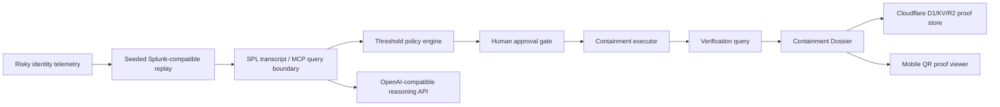

# Containment Countdown Architecture Diagram

The current public build uses deterministic replay and does not claim live Splunk credentials are configured. Cloudflare D1/KV/R2 and the OpenAI-compatible reasoning route are live production integrations.
