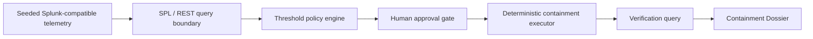

# Architecture

Containment Countdown follows one loop:

## Runtime Surfaces

- `/mission`: evidence, threshold, countdown, approval, and proof rail.
- `/decision`: SPL transcript, confidence chart, approval record, and dossier preview.
- `/dossier/demo`: mobile QR proof artifact.
- `/architecture`: integration and assumption proof.
- `/replay`: deterministic scenario picker.

## Data Boundary

The public build uses seeded Splunk-compatible telemetry. It does not claim live Splunk connectivity.

`/api/mcp/query` exposes the app's internal query route. Its live-mode path uses Splunk REST export when `SPLUNK_HOST`, `SPLUNK_TOKEN`, and `SPLUNK_INDEX` are configured. Because those values are not configured, production returns deterministic replay data and labels it as such.

Cloudflare deployment contracts:

- D1 stores evidence rows, approvals, containment actions, verification runs, and dossier metadata.
- KV stores replay/session pointers.
- R2 stores exported dossier artifacts.
- `/api/spl/generate` calls the configured OpenAI-compatible reasoning API from server-side Worker secrets.

## Security Boundary

- No real IAM or firewall change occurs in replay mode.
- Live Splunk credentials are optional live-mode inputs and must be configured as Wrangler secrets.
- OpenAI-compatible credentials stay server-side.
- The browser sees only replay state, proof artifacts, and user-facing status.
