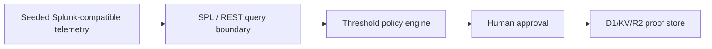

# Pitch — Containment Countdown

---

## Slide 1 · Approve containment for risky identities in 60 seconds

**Headline:** Approve containment for risky identities in 60 seconds
**Subheadline:** Evidence crosses threshold, a human approves, and the dossier keeps proof of the decision.
**Visual:** `pitch/screenshots/01-hero.png` plus the C60 seal.
**Notes:** "Risky identity incidents usually stop at an alert. This one does not. Containment Countdown gives the operator one minute: evidence crosses the threshold, a human approves, and the dossier keeps proof of the decision."

---

## Slide 2 · The handoff that fails

| Current path | What breaks |
| --- | --- |
| Alert summary | The operator still decides from scattered evidence. |
| Static dashboard | The incident looks serious, but no proof artifact follows. |
| Automated containment | The action is fast, but approval and verification are thin. |

**Notes:** "The awkward handoff is the product problem. A summary leaves the analyst assembling evidence. A dashboard shows severity but gives no receipt. Full automation is fast, but the approval trail is thin."

---

## Slide 3 · Live demo

**Visual:** `pitch/recording/pitch-demo-combined-final.mp4`
**Caption:** Threshold crossed -> approval -> replay contained -> verified.
**Notes:** "Here is the full loop. Watch for three things: the threshold crossing, the approval click, and the proof artifact. If the demo audio is on, stay quiet and let it run."

---

## Slide 4 · How it works

**Notes:** "Four pieces carry the loop: seeded Splunk-compatible telemetry provides the demo signal, threshold policy, human approval, and stored proof. The reasoning route writes a SOC note, but it does not approve the action."

---

## Slide 5 · Proof of life

| Replay action | Surface | Evidence |
| --- | --- | --- |
| Build dossier | `/api/dossier/build` | `persisted:true`, `cloudflare-d1-kv-r2` |
| Approve replay containment | `/api/containment/approve` | Five D1 tables receive the replay proof chain |
| Reasoning note | `/api/spl/generate` | OpenAI-compatible API returns the SOC note |

**Repo:** https://github.com/veithly/containment-countdown
**Demo:** https://containment-countdown.veithly.workers.dev
**Video:** https://www.youtube.com/watch?v=ZEs74UweOkc
**Deck:** `pitch/deck/containment-countdown-deck.pdf`
**Looking for:** Splunk reviewers who can inspect the integration path while the public demo stays on seeded Splunk-compatible telemetry.

**Notes:** "Everything here is inspectable: app, repo, deck, video, architecture, and smoke proof. The claim is narrow: seeded Splunk-compatible telemetry in the public demo, live Cloudflare proof storage, and a live reasoning route."
