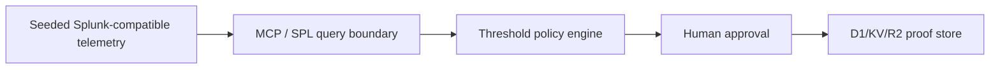

# Pitch — Containment Countdown

---

## Slide 1 · Approve containment for risky identities in 60 seconds

**Headline:** Approve containment for risky identities in 60 seconds  
**Subheadline:** Evidence crosses threshold, a human approves, and the dossier proves the action.  
**Visual:** `pitch/screenshots/01-hero.png` plus the C60 seal.  
**Notes:** "Approve containment for risky identities in 60 seconds after evidence crosses threshold. Start with the action, then show the proof."

---

## Slide 2 · The handoff that fails

| Current path | What breaks |
| --- | --- |
| Alert summary | The operator still decides from scattered evidence. |
| Static dashboard | The incident looks serious, but no proof artifact follows. |
| Automated containment | The action is fast, but approval and verification are thin. |

**Notes:** "Security teams do not need another alert paragraph. They need a short path from evidence to a reversible, documented action."

---

## Slide 3 · Live demo

**Visual:** `pitch/recording/pitch-demo-combined-final.mp4`  
**Caption:** Threshold crossed -> approval -> contained -> verified.  
**Notes:** "Watch the countdown. The evidence crosses the policy threshold, the operator approves, and the dossier records what happened."

---

## Slide 4 · How it works

**Notes:** "Three pieces matter: Splunk-shaped evidence, human approval, and stored proof. Live Splunk can replace replay once credentials are configured."

---

## Slide 5 · Proof of life

| Action | Surface | Evidence |
| --- | --- | --- |
| Build dossier | `/api/dossier/build` | `persisted:true`, `cloudflare-d1-kv-r2` |
| Approve containment | `/api/containment/approve` | Five D1 tables receive the proof chain |
| Reasoning note | `/api/spl/generate` | OpenAI-compatible API returns the SOC note |

**Repo:** pending public GitHub URL  
**Demo:** https://containment-countdown.veithly.workers.dev  
**Video:** `pitch/recording/pitch-demo-combined-final.mp4`  
**Looking for:** Splunk reviewers who can test the live credential path.

**Notes:** "Everything in the public demo is reproducible. The claim is narrow: live Cloudflare proof storage and reasoning API, seeded Splunk-compatible telemetry."
