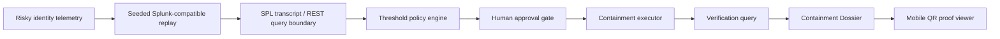

# Containment Countdown Architecture Diagram

Seeded Splunk-compatible telemetry is the public evidence model. When `SPLUNK_HOST`, `SPLUNK_TOKEN`, and `SPLUNK_INDEX` are configured, the same SPL/REST boundary can use live Splunk as the evidence and verification source.
