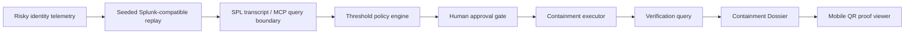

# Containment Countdown Architecture Diagram

```mermaid
flowchart LR
  A["Risky identity telemetry"] --> B["Seeded Splunk-compatible replay"]
  B --> C["SPL transcript / MCP query boundary"]
  C --> D["Threshold policy engine"]
  D --> E["Human approval gate"]
  E --> F["Containment executor"]
  F --> G["Verification query"]
  G --> H["Containment Dossier"]
  H --> I["Mobile QR proof viewer"]
```

The current build uses deterministic replay and does not claim live Splunk credentials are configured.
